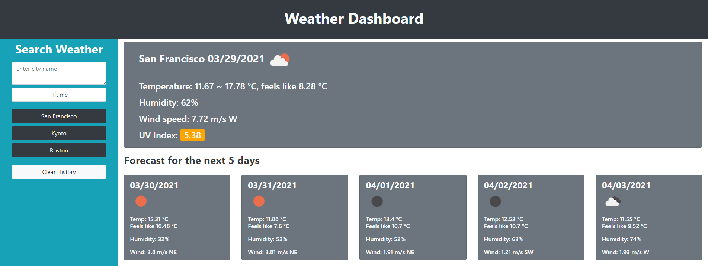

# Weather-Dashboard

## Description
This is a weather dashboard. The user can search the name of a city, and data will be retrieved to present the weather today as well as forecast for the next 5 days.

## Usage
The user will type in the search box the name of a city, and the webpage will automatically try to fetch data from the Open Weather Map API. Should the fetch be successful, information on temperature, humidity, and wind speed will be printed on screen. For today, the UV index will also be shown.

## Features
The layout is responsive, so the cards rearrange and resize for smaller screens.

If the user enters an invalid city name, or if the data fetch fails, the user will be presented with a warning message.

If the data fetch is successful, then the weather will be printed.

For both today and forecast, weather icons will be displayed.

The UV index will be color coded to signify its danger level: green-low, yellow-medium, orange-high, red-very high, purple-don't go outside.

When a valid city is searched that isn't searched previously, it will print out a new button.

The previous search will be stored locally along with individual buttons with the first letter in every word capitalized, and the buttons are clickable. When clicked, it will fetch the data corresponding to the city.

There is a reset button to clear the buttons and local storage.

## Deployed Link
https://runescape11111.github.io/Weather-Dashboard/

## Screenshot
